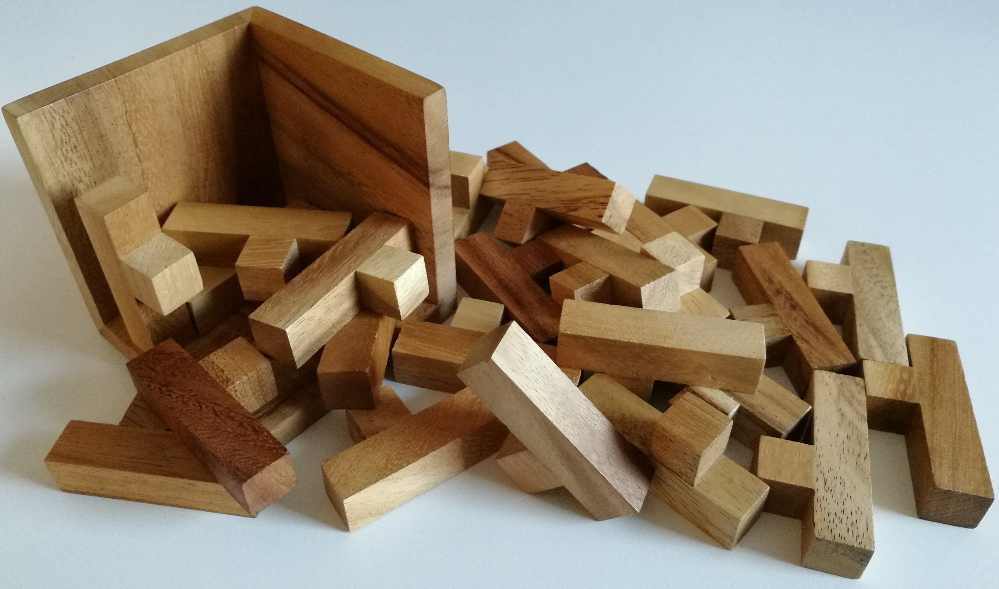
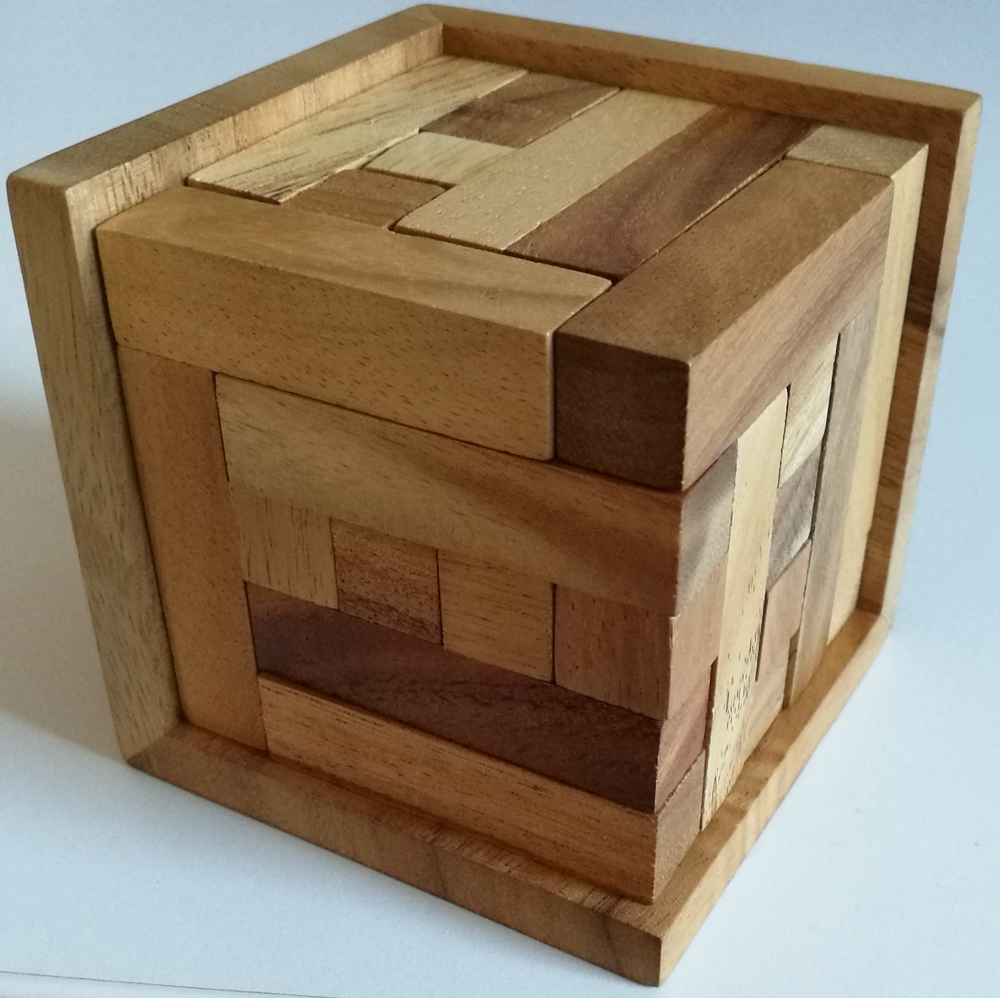
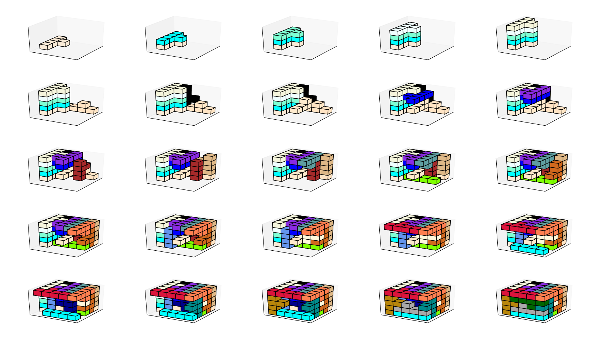

# C5
A solver for different puzzles, written in Python3.

A solution for 
 
is e.g.
 as calculated by C5


# Method:
C5 works on a voxel grid that repesents the available space in the cube.
For a given occupancy of the grid with puzzle pieces, it adds a new piece (in all potential orientations) to the most low-left-bottom open voxel of the grid, and considers that modified grid as new starting point. This is repeated until a solution is found or all potential occupations have been exhausted.

A heuristic is used to rule out occupations that can not be solved anymore to greatly speed up the process.

# Requirements:
```
pip install matplotlib numpy sortedcontainers
```

# Run:
```
git clone https://martinweismann/C5.git
cd C5/Source
python3 main.py
```
